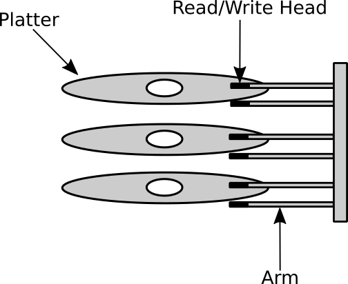
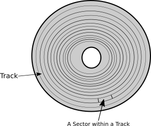

#### Introduction and x86 assembly language overview

- **Boot loader**: code that is responsible for loading the main kernel from the disk to the main memory.
- A basic knowledge of the target architecture assembly is required to build a kernel, which in our case x86.
- An assembler is required to to convert assembly language code to machine language.
- We will be using Netwide Assembler (NASM). [^1]
---
#### Registers
- In any processor architecture, a **register** is a small memory inside the processor's chip.
- In x86 there are two types of registers: general purpose registers and special purpose registers.
  - The general purpose registers can store any kind of data. 
  - The special purpose registers are provided by the architecture for some specific purposes (to be covered later).
- x86 provides us with **8 general purpose registers** 
  - To read from or write to these we refer to them by their names in assembly code.
  - The names of these registers are: EAX, EBX, ECX, EDX, ESI, EDI, EBP, and ESP.
  - // **(ABCD-X, SD-I, BS-P) (B-XP, D-XI, S-PI)**
  -    The size of each is **32 bits** (**4 bytes**)
  -    E means 'extended'
  -    the register name without the E, for eg AX, can be used to access the first 16 bits of the register (this naming convention supports legacy 16bit architectures)
  - The first 16 bits of these registers can be divided into two parts and each one of them is of size 8 bits (1 bytes) 
    - These parts have their own name that can be referred to in the assembly code: The first 8 bits: **low bits**, the second 8 bits: **high bits**.


- **NOTE**: While the registers **ESI, EDI, EBP and ESP** are considered to be general purpose registers in x86 (According to Intel's manual), they store some important data in some cases and it's better to use them carefully when we need to.

---
#### Instruction Set
- An assembly code is simply a set of instructions which will be **executed sequentially**.
- The processor's architecture provides these instructions. [^2]
- Processor is the ultimate library for instructions, just like functions are provided by libraries in languages like C, Go
- An Instruction 
  - has a name,
  - performs a specific job,
  - can take parameters, which are called **operands**.
- Depending on the instruction itself, the operands can be 
    - a static value (e.g. a number),
    - a register name that the instruction is going to fetch the stored value from to be used by it,
    - a memory location.

---
#### Nasm
- It is an open-source assembler for x86 architecture which uses Intel's syntax of assembly language. [^3]
- Basic usage of NASM command is 
   `nasm -f <format> <filename> [-o <output>]`
  - This command generates the corresponding machine code from the x86 assembly code file. [^4]
  - The argument `<format>` decides the binary format of the generated machine code (will be discussed later).
  - The argument `<filename`> is the name of the assembly file that we would like to assemble
  - The last option and argument are optional, they are used for naming the output file. The default name is 'filename'.

/* WIP
- Example assembly code:
  ```
    mov ax, 0Eh
    mov al, 's'
    int 10h
  ```
   - 0Eh hexadecimal
   - Single quotation is used in NASM to represent strings or characters.

*/

---
#### Binary Format

- Each executable file uses some binary format to organize its content.
- A binary format describes the structure of the binary file, i.e how multiple parts in it are organised.
- Each OS has its own binary format. 
  - eg ELF is the default in Linux.
  - Mach-O is used by Mach-based. [^5]
  - Portable Executable (PE) used by Microsoft Windows.
- All programming languages compile to produce an executable formatted with the same binary format.
  - For example in Linux, if we create a software either by C, Go, Rust or assembly, the last executable result will be a binary file that is formatted by using **Executable and Linkable Format (ELF)** binary format. 
  - By using the specification of ELF, the Linux kernel will be able to locate the machine code of the software inside the ELF file and load it into memory and prepare it for execution.

---
#### GNU Make
- GNU Make is a build automation tool. 
- It automates the building process of the binary file.
- The steps include compiling and assembling the source code, then linking the generated object files to produce the binary file.
  - An object file is a machine code of a source file and it is generated by the compiler.
- All the required commands are gathered in a text file known as **Makefile**
  - This file is used with command `make`
- GNU Make is going to run commands in the file sequentially.
- it also checks whether a code file is modified since the last building process.
  - If the file is not modified then the generated object file from the last building process is used.
- There is a specific syntax followed when writing makefile.
- It has a list of _rules_ that define how to create the executable file.
- Each rule has the following format:
  ```
  target: prerequisites
  recipe
  ```
  - The name of a target can be a general name or filename.
  - The prerequisites part of a rule is sort of a list of dependencies of this rule.
    -  these dependencies can be either filenames (the C files of the source code for instance) or other rules in the same makefile.
  -  The recipe part contains the commands that are going to run when the rule is being executed.
      - Each line here should start with a tab.
      - Any arbitrary linux commands can be used in the recipe.
  - makefile can have variables which can defined as: `foo = bar` and can be used in the rules as: `$(foo)`.
- `make <target_name>` executes the target rule.
  - if the rule has a dependency, which is another rule, that rule should be executed successfully first.
  - if there is a filename in the dependencies list and there is no rule that has the same filename as a target name, then this file will be checked and used in the recipe of the rule.
- When running `make` without arguments, the first rule in the makefile which does NOT start with dot (eg .xyz) is run.
- One of well-known convention is to define a rule with target name _clean_  which deletes all object files and binaries that have been created in the last building process.
- Consider the following C source files:
  - file1.c
    ```
    #include "file2.h"
    int main()
    {
      func();
    }
    ```
  - file2.h
     ```
    void func();
    ```
  - file2.c
    ```
    #include <stdio.h>
    void func()
    {
      printf( "Hello World!" );
    }
    ```
- By using these three files, let's take an example of a makefile with filenames that have no rules with same target's name.
  ```
  build: file1.c file2.c
    gcc -o ex_file file1.c file2.c
  ```
  - The target name of this rule is build.
  - To execute this rule we can use either `make build` or simply `make` (as it is the first rule and doesnt start with dot).
  - The rule *build* depends on two C files, file1.c and file2.c, they should be available on the same directory. 
  - The *recipe* uses GNU GCC to compile and link these two files and generate an executable file named *ex_file*.
- The following is an example of a makefile that has multiple rules.
  ```
  build: file2.o file1.o
    gcc -o ex_file file1.o file2.o
  file1.o: file1.c
    gcc -c file1.c
  file2.o: file2.c file2.h
    gcc -c file2.c file2.h
  ```
    - The first rule *build* depends on two object files file1.o and file2.o.
      - Before running the building process for the first time, these two files will not be available in the source code directory because they are a result of the compiling step that has not been performed yet. So, we have defined a rule for each one of them. 
    - The rule file1.o is going to generate the object file file1.o and it depends on file1.c, the object file will be simple generated by compiling file1.c.
    - The same happens with file2.o but this rule depends on two files instead of only one.

- We can redefine the second makefile by using the variables.
  ```
  c_compiler = gcc
  buid_dependencies = file1.o file2.o
  file1_dependencies = file1.c
  file2_dependencies = file2.c file2.h
  bin_filename = ex_file
  build: $(buid_dependencies)
    $(c_compiler) -o $(bin_filename) $(buid_dependencies)
  file1.o: $(file1_dependencies)
    gcc -c $(file1_dependencies)
  file2.o: $(file2_dependencies)
    gcc -c $(file2_dependencies)
  ```
---
#### The Emulators
- We will use an emulator to run our kernel to test it. [^6]
- An emulator is a software that acts like a full computer and by using it you can run any code that require to run on a bare metal hardware.
    - for eg, using emulator, we can create a virtual hard disk that can be used by the kernel. 
    - This virtual hard disk will be a normal file in the host  system, if anything goes wrong in our code, no data will be lost in main system.
- We will use the open source [QEMU](https://www.qemu.org/) emulator [^7].
  - It provides a way to use GNU Debugger through command line.
  - A kernel image can be run with the simple command: 
    ```
    qemu-system-x86_64 our_kernel.img
    ```
    - `our_kernel.img` is the binary file of the kernel and the bootloader. 
    - the option `-s` is used with QEMU to make GNU debugger be able to connect to QEMU to start a debugging session.[^8]

---
#### Writing the Boot Loader
- When a computer powers on, a piece of code named bootloader is loaded first which takes the control of the computer.
- The **firmware** of a computer is the program which loads the bootloader
  - in IBM-compatible computers the name of this firmware is **BIOS** (Basic Input/Output System) 
  - This was before the advent of **UEFI**. 
- BIOS loads the content of the boot sector as a first step of running the operating system. 
  -  The **boot sector** is the first sector of a hard disk.
  - Loading the boot sector's content means that BIOS reads the content from hard disk and loads it into the main memory (RAM). 
  - This loaded content should be the bootloader
  - Once it is loaded into the main memory, the processor will be able to execute it as any other code. 
  - The last step performed by BIOS is giving the control to the bootloader.
- In IBM-compatible PCs that uses BIOS to perform the booting process, **the size of the bootloader is limited to 512 bytes**
  - The limited size is because BIOS is only going to load the content of the first sector of hard disk, the boot sector.
  - The size of a sector in the hard disk is 512 bytes
- Due to this limited size and the need of using low-level services, the bootloader is usually written in assembly language,
  -  After the bootloader is loaded by BIOS, it is used to load the kernel, which is much bigger than 512 bytes.
- The bootloader is going to run on an **x86 operating mode** known as **real mode**.
  - real mode is a 16-bit environment,
  - so, even if the working processor is a 64-bit processor, we can only use 16-bit features of the processor, such as the registers of size 16 bits.
- The booting process is too specific to the computer architecture and each may differ with another.
- Before getting started in writing 539kernel, we need to write the bootloader that is going to load 539kernel from the disk. 

---
#### Hard Disk Structure
- A hard disk consists of multiple *platters* which are stacked together one above the other.
  - A platter has the same shape as a CD or DVD. 
  - Both surfaces (top and down) of a platter are covered by a magnetic layer which stores the data.
  - For each surface of a platter there is a read/write head on it
  - A head is attached to an arm, which moves horizontally, back and forth
  - The other end of all the arms are attached to the same physical part, so they will be moved back and forth together to the same location at the same time.
    - the collection of all these tracks that the heads point to at some point of time is called a *cylinder*.
  - 
  
- A surface of a platter is divided into a number of tracks and each track is divided into a number of sectors. 
  - In Figure below, the gray concentric circles are the **tracks**.
  - A track consists of a smaller parts which called **sectors**, which is the smallest unit that holds data in hard disks.
  - 
  
- When a command is sent to the hard disk to read or write data, at least two mechanical moves are performed. 
  - The first move is by the arms, which move back or forth in order to be upon the track that contains the data we would like to read
  - This operation is known as **seek operation**.
  - **seek time** is the time needed to put a specific track under a read/write head.
 -  After finishing the seek operation, to reach the required sector the platter rotates. 
    - The speed of rotation is measured by a unit known as revolutions per minute (**RPM**) 
    - The needed time to reach the required sector is known as **rotational latency**.
 -  Finally, the data will be *transferred* from the hard disk to the main memory.
    - The time needed to transfer a number of bits known as **transfer time**.
 - Eg. when BIOS loads a bootloader, first, the arms will seek the track number `0`, then the platter rotates until the read/write head become upon the sector `0`, finally, the content of sector `0` is transferred to the main memory.

---
#### BIOS Services
- BIOS provides us with a bunch of useful services that can be used in real mode, by bootloader to get things done.
  - they are like a group of functions in high-level languages that are provided by some library.
- BIOS services are divided into categories, 
  - there are video services category, disk services category, keyboard services category and so on.
  - Each category is identified by a unique number called **interrupt number**.
    
    - Eg. the category of video services has the interrupt number `10h` or `0x10` [^9]
    - Interrupts is a fundamental concept in x86 architecture. They are a way to call a specific code which is assigned to the interrupt number.
  - Inside each services category, there is a bunch of services, each one can do a specific thing and they are identified by a number.
    - Eg. in the video services category, the service of printing a character on a screen is used by number `0Eh` or `0x0E`.
- To use any BIOS services,
  - we need to know what is the interrupt number that the service belongs to,
  - we need to know the number of the service itself which will have to be put in `ah` before calling the interrupt using `int`.
  - we will need to know the the information required by the service, which has to be stored in `specific registers`
- For eg, the following assembly code requests from BIOS to print the character `S` on the screen: 
    ```{.asm}
    mov ah, 0Eh
    mov al, 'S'
    int 10h
    ``` 
  - BIOS will know from `int 10h` that we want to use one of available video services.
  - To tell BIOS which video service we want to use, we need to specify service number in `ah` register *before* calling the interrupt.
  - To execute the video service `0Eh`, BIOS expects to find additional information, ie the character to print, in a specific register, `al`
    - `al` is one of the service parameter.


---
#### A Little Bit More of x86 Assembly and NASM
- To write comments on NASM we begin with semi-colon.
- In NASM, each line in the source code has the following format. 
  ```{.asm}
  label: instruction operands
  ```
  - The operands depend on x86 instruction in use and can be empty if not required for that instruction.
  - The **label** is a human-readable name for a memory address which can contain, code or data.
    - It is optional
    - It can be used to make the code more readable.
    - It can be used in code to represent a single or group of instructions.
    - It can be written without the colon.
  - Eg
    ```{.asm}
    print_character_S_with_BIOS:
        mov ah, 0Eh
        mov al, 'S'
        int 10h
    ```
    - here we gave a name for the instructions that print the character `S` on the screen which can be used anywhere in the same code file.
  - Eg 2
      ```{.asm}
      call_video_service int 10h
      ```
    - label without colon, for a single instruction.  
  - Extra whitespaces and new lines doesn't matter in NASM, so the following is equivalent to the one above.

    ```{.asm}
    call_video_service
        int 10h
    ```
  - Eg 3
    ```{.asm}
    print_character_S_with_BIOS:
        mov ah, 0Eh
        mov al, 'S'

    call_video_service:
        int 10h
    ```
    - This code still it prints `S` on the screen.
    - Introducing labels in the source code doesn't change its flow, the code will be executed sequentially.
  - If we need to change the sequence of execution we need to use other methods
    - one of these methods is calling an interrupt.

#### Jump and Return Unconditionally

##### A Glance on a Computer Architecture

- The architecture where both code and data are stored in the same memory for the processor to fetch the instructions that should be executed and data to be manipulated from, is known as **von Neumann architecture**. [^10]
  - Simply put, when a program is running, a copy of its machine code is loaded in the main memory, 
    - this machine code is a sequence of instructions which are understandable by the processor, 
    - these instructions are executed by the processor sequentially, one after another in each cycle in the processor, 
  - The data that the code being executed is dealing with is also stored in the same main memory.
- Few concepts before understanding the code below:
  - Each *memory location* in the main memory is represented and referred to by a unique **memory address**
  - Each instruction in the machine code of a loaded program has a unique memory address.
  - In x86, the program counter is a register known as **instruction pointer** and its name is `IP` in 16-bit and `EIP` in 32-bit.
    - **Program Counter** is a part of computer architecture which stores the *memory address* for the instruction that will be executed in the next instruction cycle of the processor. 
    
  - When a processor starts a new *instruction cycle*, it fetches the next instruction that should be executed from the main memory and executes it
    - The instruction cycle is also called *fetch-decode-execute cycle*.
  - Each running program has a **stack** 
    - it is a place in the memory that belongs to the program and can store data.
    - The stack as a region of memory (x86 stack) is not same as the *data structure* stack, the former implements the latter.
- Eg
  ```{.c}
  100 main() {
  110    int result = sum( 5, 3 );
  120    printf( "%d\n", result );
  130 }
  
  250 int sum( int firstNumber, int secondNumber ) {
  260     return firstNumber + secondNumber;
  270 }
  ```
  - The number on the left is the hypothetical memory address of the code line in the right.
  - The function which call another is named *caller* while the function which is called by the caller named *callee*.
    - in the above, the caller is the function `main` while the callee is the function `sum`.
  - The `sum` function reside in a different region in memory
  - When the above C code runs for the first time, the value of the instruction pointer will be `100`, ie the memory address of the starting point of `main` function.
  - When the instruction cycle starts, it reads the value of the instruction pointer register `IP`/`EIP` which is `100`, it fetches the instruction which is stored in the memory location `100` and executes it.
    - For the simplicity of explanation, the details of *decoding* have been eliminated.
  - Then the memory address of the next instruction `110` will be stored in the instruction pointer register for the next instruction cycle.
  - When the processor finishes the execution of the instruction at `110`, the value of `IP`/`EIP` will be `250` instead of `120` because we are calling the function `sum`, which resides at `250`.
  - When `sum` is called, the memory address of the next instruction of the callee `main` is *pushed* into the stack, this address is called **return address**. 
    - the memory address `120` will be pushed into the stack before calling `sum`.
    - Push means store something in a stack
    - This term is applicable for both x86 stack and the data structure stack (x86 stack is an implementation of the stack data structure.)
  - On reaching the memory location `270`, ie, finishing the execution of the callee `sum`, the processor will get the return address from the stack (`120`) and put it in the register `IP`/`EIP` for the next instruction cycle.
    - this is partially, the cause of buffer overflow bugs.
 
##### The Instructions `call` and `ret`
- In assembly, the instruction `call` 
  - is used to call a code that resides in a given memory address.
  - pushes the return address into the stack
- To return to the caller, the callee should use the instruction `ret` when it finishes.
  - The instruction `ret` *pops* value of the return address from the stack and use it to resume the execution of the caller.
- Consider the following example.
  ```{.asm}
  print_two_times:
      call print_character_S_with_BIOS
      call print_character_S_with_BIOS
      ret

  print_character_S_with_BIOS:
      mov ah, 0Eh
      mov al, 'S'
      int 10h
      ret
  ```
  - the operand of `call` is the memory address of the code that we wish to call, which is provided by label.
  - `print_character_S_with_BIOS` defines something like C functions by using the instructions `call` and `ret`.
  - the instructions of `print_character_S_with_BIOS` will be executed sequentially until the processor reaches the instruction `ret`.
    - At this point, the return address is obtained from the stack and the execution of the caller is resumed.
  - The code of `print_two_times` prints the character `S` two times
- `call` performs an **unconditional jump**, that means when the processor reaches to a `call` instruction, it will always call the callee. 
- A **conditional jump** only calls the callee when some condition is satisfied, otherwise, the execution of the caller continues sequentially with no flow change.

#### The One-Way Unconditional Jump
- The instruction `jmp` jumps to the specified memory address, like `call`.
  - We use `jmp` when we want to jump to a code that we don't need to return from
  - unlike `call`, it doesn't store the return address in the stack 
  - which means `ret` cannot be used in the callee to resume the caller's execution.
  -  it has the same functionality of `goto` statement in C. 
- Consider the following example.

  ```{.asm}
  print_character_S_with_BIOS:
      mov ah, 0Eh
      mov al, 'S'
      jmp call_video_service

  print_character_A_with_BIOS:
      mov ah, 0Eh
      mov al, 'A'

  call_video_service:
      int 10h
  ```
  - Output is `S` 
  - the code of the label `print_character_A_with_BIOS` will never be executed because of the line `jmp call_video_service`. 
  - If we remove the line of `jmp` from this code sample, `A` will be printed on the screen instead of `S`.
- Eg. which causes infinite loop.
  ```{.asm}
  infinite_loop:
      jmp infinite_loop
  ```

#### Comparison and Conditional Jump
- In x86 there is a special register called **FLAGS** register [^11]. 
  - It is the **status register** which holds the current status of the processor.
  - Each usable bit of this register has its own purpose and name,
  - Eg. the first bit (bit `0`) of FLAGS register is known as *Carry Flag* (`CF`) and the seventh bit (bit `6`) is known as *Zero Flag* (`ZF`).
- Many x86 instructions use `FLAGS` register to store their result on, one of those instructions is `cmp` which can be used to compare two integers which are passed to it as operands
  - when a comparison finishes, the processor stores the its result in `FLAGS` register. 
- Eg:
  ```{.asm}
  cmp al, 5
  ```
  - this code compares the value which reside in the register `al` with `5`
  - There are multiple instructions that perform *conditional* jump based on the result of `cmp`. 
  - One of these instructions is `je` which means *jump if equal*, ie. if the two operands of the `cmp` instruction equals each other, then jump to the specified code.
  - Another conditional jump instruction is `jne` which means *jump if not equal* 
    - the conditional jump instructions have the same functionality of `if` statement in C.
- Consider the following example.
  ```{.asm}
  main:
      cmp al, 5
      je the_value_equals_5
      ; The rest of the code of `main` label
  ```
  - This example jumps to the code of the label `the_value_equals_5` if the value of the register `al` equals `5`.
- Like `jmp`, but unlike `call`, conditional jump instructions don't push the return address into the stack, which means the callee can't use `ret` to return and resume caller's code, so the jump will be *one way jump*.
- We can also imitate `while` loop by using conditional jump instructions and `cmp`
- The following example prints `S` five times by looping over the same bunch of code.
  ```{.asm}
  mov bx, 5

  loop_start:
    cmp bx, 0
    je loop_end
    
    call print_character_S_with_BIOS
    
    dec bx
    
    jmp loop_start
    
  loop_end:
      ; The code after loop
  ```
  - we assign the value `5` to the register `bx` (since `ax` is in use)
  - the instruction `dec` is used to decrease `1` from its operand, that is `bx = bx - 1`.

#### Load String
- `1` byte equals `8` bits. 
- There are two size units in x86 other than a byte. 
  - A *word* which is `16` bits (`2` bytes) and 
  - A *doubleword* which is `32` bits (`4` bytes).
- Some x86 instructions have multiple variants to deal with these different size units, while the functionality of an instruction is the same, the difference will be in the size of the data that a variant of instruction deals with.
  - Eg. the instruction `lods` has three variants `lodsb` which works a **b**yte, `lodsw` which works with a **w**ord and `loadsd` which works with a **d**oubleword.
- To simplify the explanation, let's consider `lodsb` which works with a single byte, 
  - it reads the value of the register `si` which is interpreted as a memory address by the instruction,
  - then it transfers a byte from the content of that memory address to the register `al`,
  - finally, it increments the value of `si` by `1` byte.
-  The same holds true for the other variants of `lods`, only the size of the data, the used registers and the increment size are different, 
   - the register which is used by `lodsw` is `ax`, because the size of `ax` is a **word** and `si` is incremented by `2` bytes, 
   - `lodsd` uses the register `eax`, because the size of `eax` is a **doubleword**. and `si` is incremented by `4` bytes. 
   
#### NASM's Pseudoinstructions
- NASM provides us with a number of **pseudo** [^12] instructions
  - they are not real x86 instructions, the processor doesn't understand them.
- NASM understands the pseudo instructions and can translate them to something understandable by the processor.
- They make the writing of the bootloader easier.

##### Declaring Initialized Data
- The concept of *declaring something* is well-known by the programmers, In C for example, when you *declare* a function, you are announcing that this function *exists*, it is there, it has a specific name and takes the declared number of parameters. 
  - It is important to note that *declaring* a function in C differs from *defining* a function, the following declares a function: `int foo();` You can see that the code block (the implementation) of `foo` is not a part of the declaration, once the code block of the function is presented, we say this is the *definition* of the function.
- The same concept holds true when you declare a variable, you are letting the rest of the code know that there exists a variable with a specific name and type. 
- When we declare a variable, without assigning any value to it, we say that this variable is *uninitialized*, that is, no initial value has been assigned to this variable when it was declared, later on, a value will be assigned to the variable, but not as early of its declaration.
- In contrast, a variable is *initialized* when a value is assigned to it when it's declared.
- The pseudoinstructions `db`, `dw`, `dd`, `dq`, `dt`, `ddq` and `do` help us to initialize a memory location with some data, and with using labels when can mimic the concept of initialized variables in C. 
- As an example, let's consider `db` which declares and initializes a byte of data, the second letter of `db` means *b*ytes.
  ```{.asm}
  db 'a'
  ```
  - The above example reserves a byte in the memory, this is the declaration step, then the character `a` will be stored on this reserved byte of the memory, which is the initialization step.
- 
  ```{.asm}
  db 'a', 'b', 'c'
  ```
  - In the above example we have used comma to declare three bytes and store the values `a`, `b` and `c` respectively on them,
  - on memory these values will be stored *contiguously*, 
  - Since `a`, `b` and `c` are of the same type, a character, we can write the previous code as the following and it gives as the same result.
    ```{.asm}
    db 'abc'
    ```
- We can also declare different types of data in the same source line
- Eg if we would like to store the number `0` after the character `c`, this can be achieved by simply using a comma.

  ```{.asm}
  db 'abc', 0
  ```
- Now, to make this data accessible from other parts of the code, we can use a label to represent the starting memory address of this data. Eg.
  ```{.asm}
  our_variable db 'abc', 0
  ```
  - it defines the label `our_variable`, after that, we can use this label to refer to the initialized data.

##### Repeating with `times`
- To repeat some source line multiple times, we can use the pseudoinstruction `times`
- The following example prints `S` five times on the screen.

  ```{.asm}
  times 5 call print_character_S_with_BIOS
  ```
  - first operand is the number of repetitions
  - second operand is the instruction that we would like to execute repeatedly. 
  - x86 instructions can be used with `times` as second operand
  - NASM's pseudoinstructions can be also be used with `times`. 
  - The following example reserves `100` bytes of the memory and fills them with `0`.

    ```{.asm}
    times 100 db 0
    ```

#### NASM's Special Expressions
- In programming languages, an *expression* is a part in the code that evaluates a value, 
  - for example, `x + 1` is an expression, also, `x == 5` is an expression. 
- A *statement* is a part of the code that performs some action, 
  - for example, in C, `x = 15 * y;` is a statement that assigns the values of an expression to the variable `x`.
- NASM has two special expressions, 
  - `$` which points to the beginning of the *assembly position* of the current source line. 
    - So, one way of implementing infinite loop is the following: `jmp $`. 
  - `$$` which points to the beginning of the current *section* of assembly code.

---
// check and del: 
[As we will see later, a magnetic hard disk has multiple stacked platters, each platter is divided into multiple tracks and inside each track there are multiple sectors.],

---
*Additional Notes*
- Pentium 4 for instance supports 32 bit architecture, Intel 8086 does not, as it is a 16bit architecture.
- See study material list for x86 architecture tutorials

[^1]: GNU Assembler (GAS) is another alternative
[^2]: Manual for available instructions on x86: [Intel® 64 and IA-32 architectures software developer's manual](https://software.intel.com/en-us/articles/intel-sdm)
[^3]: Other well-known syntax for assembly language is AT&T syntax.
[^4]: The process of transforming an assembly source code to machine code is known as assembling.
[^5]: Mach is an operating system's kernel which is well-known for using microkernel design. It has been started as a research effort in Carnegie Mellon University in 1985. Current Apple's operating systems macOS and iOS are both based on an older operating system known as NeXTSTEP which used Mach as its kernel.
[^6]: Kernel can also be run by writing the image of the kernel on a bootable device and reboot you machine over and over again.
[^7]: [Bochs](https://bochs.sourceforge.io/) is another open source emulator. Its debugger provides an easy GUI that saves a lot of time. To run your kernel by using Bochs, you need to create a configuration text file named bochsrc. Each time you run Bochs it will use this configuration file which tells Bochs the specifications of the virtual machine that will be created, these specifications are something about the virtual processors, their number, their available feature, the number of available virtual disks, their options, the path of their files and so on. Also, whether the debugger of Bochs and its GUI is enabled or not are decided through this configuration file. This configuration can be easily created or edited by using a command line interface through running the command bochs with no arguments. After creating the file you can use the option -f bochsrc where bochsrc is the filename of the configuration file to run your kernel directly with no question from Bochs about what to do.
[^8]: More about QEMU in its [official documentation](https://www.qemu.org/docs/master/).
[^9]: `0x` can be used as a prefix instead of `h`. C programming language, for instance, uses `0x` prefix for hexadecimal numbers.
[^10]: There is another well-known architecture called *Harvard architecture* where the code and data are stored in two different memories, x86 uses *von Neumann architecture*.
[^11]: In 32-bit x86 processors its name is *EFLAGS* and in 64-bit its name is *RFLAGS*.
[^12]: For example, in algorithm design which is a branch of computer science, the term **pseudo**code means a code that is written in a fake programming language. Another example is the word **pseudo** science: A statement is a pseudoscience when it is claimed to be a scientific fact, but in reality it is not, that is, it doesn't follow the scientific method.
